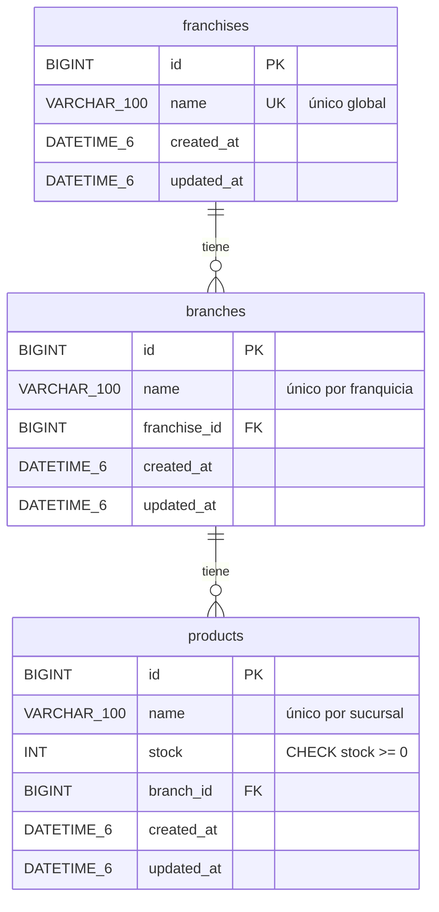

# Franchise API

API REST para gestionar franquicias, sus sucursales y los productos que ofrece cada sucursal, con control de stock.

**Stack:** Java 21 · Spring Boot 3.5 · Spring Data JPA · MySQL 8.4 · Flyway · springdoc-openapi · JUnit 5 / Mockito · Testcontainers · Docker.

---

## Base de datos

MySQL 8, `utf8mb4` / `utf8mb4_unicode_ci`. Todo el esquema lo crea y versiona **Flyway** al arrancar la API (`src/main/resources/db/migration`); Hibernate solo lo valida (`ddl-auto: validate`).



| Migración | Contenido |
|---|---|
| `V1__create_franchises_table.sql` | Tabla `franchises`, `UNIQUE (name)` |
| `V2__create_branches_table.sql` | Tabla `branches`, `UNIQUE (franchise_id, name)`, FK a `franchises` con `ON DELETE CASCADE` |
| `V3__create_products_table.sql` | Tabla `products`, `UNIQUE (branch_id, name)`, `CHECK (stock >= 0)`, FK a `branches` con `ON DELETE CASCADE`, índice `(branch_id, stock DESC)` para el reporte |
| `R__stored_procedures.sql` | Procedimientos almacenados (migración *repetible*: Flyway la vuelve a aplicar cada vez que cambia) |

### Procedimientos almacenados

La API hace **todas las escrituras y el reporte de mayor stock** a través de procedimientos almacenados; las lecturas simples (listar, consultar por id) usan Spring Data JPA. Las reglas de negocio viven en los procedimientos, así que se cumplen para cualquier cliente de la base de datos, no solo para la API.

| Procedimiento | Parámetros | Devuelve |
|---|---|---|
| `sp_franchise_create` | `name` | La franquicia creada |
| `sp_franchise_update_name` | `franchise_id, name` | La franquicia renombrada |
| `sp_franchise_top_stock_products` | `franchise_id` | Producto con más stock de cada sucursal |
| `sp_branch_create` | `franchise_id, name` | La sucursal creada |
| `sp_branch_update_name` | `branch_id, name` | La sucursal renombrada |
| `sp_product_create` | `branch_id, name, stock` | El producto creado |
| `sp_product_update_stock` | `branch_id, product_id, stock` | El producto actualizado |
| `sp_product_update_name` | `branch_id, product_id, name` | El producto renombrado |
| `sp_product_delete` | `branch_id, product_id` | — |

Auxiliares internos: `sp_raise_error` y `sp_assert_valid_name`.

Reglas que aplican:

- Los nombres se recortan (`TRIM`), son obligatorios, de máximo 100 caracteres y únicos en su ámbito sin distinguir mayúsculas. Al renombrar, el propio registro no cuenta como duplicado.
- El stock es obligatorio y no puede ser negativo (además de la restricción `CHECK`).
- Las operaciones sobre un producto reciben también la sucursal: un producto que no pertenece a la sucursal indicada se trata como inexistente y no se modifica.

Cuando un procedimiento rechaza una llamada lanza `SIGNAL SQLSTATE '45000'` con un código, y la API lo traduce a HTTP (`StoredProcedureErrors`):

| `MYSQL_ERRNO` | Significado | HTTP |
|---|---|---|
| `50400` | Dato inválido (nombre vacío o largo, stock negativo) | 400 |
| `50404` | Franquicia, sucursal o producto inexistente | 404 |
| `50409` | Nombre ya usado en su ámbito | 409 |

Ejemplo desde un cliente MySQL:

```sql
CALL sp_franchise_create('Franquicia Medellin');
CALL sp_branch_create(1, 'Sucursal El Poblado');
CALL sp_product_create(1, 'Laptop Lenovo', 25);
CALL sp_product_update_stock(1, 1, 50);
CALL sp_franchise_top_stock_products(1);
```

### Crear la base de datos y el usuario

- **Con Docker Compose** no hay que hacer nada: el contenedor de MySQL crea la base de datos y el usuario, y Flyway crea tablas y procedimientos al arrancar la API.
- **Con un MySQL propio** (local o en la nube), ejecutar una vez como administrador el script [`database/setup.sql`](database/setup.sql), que crea la base `franchise_db` y el usuario `franchise_user` con los permisos necesarios (cambiar la contraseña antes):

  ```bash
  mysql -u root -p < database/setup.sql
  ```

  Luego arrancar la API apuntando a ese servidor; Flyway crea tablas, índices y procedimientos.

  > **No ejecutes a mano los archivos de `db/migration`.** Flyway solo migra un esquema vacío o uno que él mismo creó: si encuentra objetos sin su tabla `flyway_schema_history`, la API no arranca (error *non-empty schema*). Además, lo que se cree como `root` no lo puede reemplazar después `franchise_user`. Si ya pasó, deja la base vacía (`DROP DATABASE franchise_db;` y vuelve a ejecutar `setup.sql`) y arranca la API.

## Endpoints

Base: `/api/v1`

| Método | Ruta | Descripción |
|---|---|---|
| `POST` | `/franchises` | Crear franquicia |
| `GET` | `/franchises` | Listar franquicias |
| `GET` | `/franchises/{franchiseId}` | Consultar franquicia |
| `PATCH` | `/franchises/{franchiseId}/name` | Renombrar franquicia |
| `POST` | `/franchises/{franchiseId}/branches` | Agregar sucursal a una franquicia |
| `GET` | `/franchises/{franchiseId}/branches` | Listar sucursales de una franquicia |
| `GET` | `/franchises/{franchiseId}/top-stock-products` | Producto con más stock por sucursal |
| `PATCH` | `/branches/{branchId}/name` | Renombrar sucursal |
| `POST` | `/branches/{branchId}/products` | Agregar producto a una sucursal |
| `GET` | `/branches/{branchId}/products` | Listar productos de una sucursal |
| `DELETE` | `/branches/{branchId}/products/{productId}` | Eliminar producto de una sucursal |
| `PATCH` | `/branches/{branchId}/products/{productId}/stock` | Modificar stock de un producto |
| `PATCH` | `/branches/{branchId}/products/{productId}/name` | Renombrar producto |
| `GET` | `/products/{productId}` | Consultar producto |

La documentación interactiva (Swagger UI) queda en `http://localhost:8080/swagger-ui.html` y el contrato OpenAPI en `/v3/api-docs`. El health check está en `/actuator/health`.

### Producto con más stock por sucursal

`GET /franchises/{id}/top-stock-products` devuelve, para cada sucursal de la franquicia, el producto con mayor stock y la sucursal a la que pertenece. Se resuelve con **una sola llamada** al procedimiento `sp_franchise_top_stock_products`, que usa `ROW_NUMBER() OVER (PARTITION BY branch_id ORDER BY stock DESC, id ASC)`, apoyada en el índice `(branch_id, stock DESC)`; no hay problema N+1.

- **Empates:** gana el producto más antiguo (menor id), así el resultado es determinista.
- **Stock 0:** es un máximo válido y se reporta.
- **Sucursales sin productos:** se omiten por defecto; con `?includeBranchesWithoutProducts=true` aparecen con los campos de producto en `null`.

### Errores

Todas las respuestas de error usan el mismo formato:

```json
{
  "timestamp": "2026-09-30T18:00:00",
  "status": 404,
  "error": "Not Found",
  "message": "Franchise with id 10 not found",
  "path": "/api/v1/franchises/10"
}
```

| Código | Cuándo |
|---|---|
| 400 | Validación fallida (`validationErrors` indica el campo), JSON mal formado, id no numérico, stock negativo |
| 404 | El recurso no existe, o el producto no pertenece a la sucursal indicada en la ruta |
| 409 | Nombre duplicado en su ámbito (al crear o al renombrar) |

## Ejecución

### Con Docker Compose (recomendado)

Requisitos: Docker Desktop.

```bash
cp .env.example .env
docker compose up -d --build
```

Levanta MySQL y la API; la API espera a que MySQL esté sano y Flyway aplica las migraciones al arrancar. La API queda en `http://localhost:8080`.

```bash
docker compose logs -f api   # ver logs
docker compose down          # detener
docker compose down -v       # detener y borrar los datos
```

### Local con Maven

Requisitos: JDK 21, Maven 3.9 y un MySQL accesible (por ejemplo, solo el servicio de base de datos: `docker compose up -d mysql`).

```bash
mvn spring-boot:run
```

### Variables de entorno

| Variable | Por defecto | Uso |
|---|---|---|
| `DB_HOST` | `localhost` | Host de MySQL |
| `DB_PORT` | `3306` | Puerto de MySQL |
| `DB_NAME` | `franchise_db` | Base de datos |
| `DB_USERNAME` | `franchise_user` | Usuario |
| `DB_PASSWORD` | `franchise_password` | Contraseña (cambiarla fuera de desarrollo) |
| `DB_PARAMS` | `useSSL=false&allowPublicKeyRetrieval=true` | Opciones de seguridad JDBC; con una base gestionada en la nube usar `sslMode=REQUIRED` |
| `DB_MAX_LIFETIME_MS` | `1800000` | Vida máxima de una conexión del pool; bajarla si el proxy de la base corta antes |
| `SERVER_PORT` / `PORT` | `8080` | Puerto HTTP. `PORT` es el que inyectan Render, Railway, Heroku o Cloud Run; `SERVER_PORT` tiene prioridad |
| `SWAGGER_ENABLED` | `true` | `false` oculta Swagger UI y `/v3/api-docs` |

## Despliegue

La aplicación se distribuye como una imagen Docker sin estado; el único estado es MySQL. Al arrancar, Flyway migra la base, así que desplegar una versión nueva es solo reemplazar el contenedor.

### Integración continua (GitHub Actions)

`.github/workflows/ci.yml` (en la raíz del repositorio):

- En cada push y pull request ejecuta `mvn verify` (pruebas unitarias y de integración con Testcontainers) y construye la imagen.
- En cada push a `main` publica la imagen en GitHub Container Registry: `ghcr.io/alejovl04/franchise-api:latest` y `:sha-<commit>`. Un tag `vX.Y.Z` publica además `:X.Y.Z`.

Como el repositorio es público, la imagen también lo es y se descarga sin credenciales (`docker pull ghcr.io/alejovl04/franchise-api:latest`). Si el repositorio pasara a ser privado, el servidor tendría que hacer `docker login ghcr.io` con un token con permiso `read:packages`.

### Opción A: un servidor con Docker Compose (VM)

Requisitos: una VM con Docker Engine y Compose v2.24 o superior, y los puertos 80/443 (o el de la API) abiertos.

```bash
git clone https://github.com/AlejoVL04/FranquiciasAccenture.git
cd FranquiciasAccenture/franchise-api
cp .env.example .env        # poner contraseñas reales y SWAGGER_ENABLED si aplica
docker compose -f docker-compose.yml -f docker-compose.prod.yml pull
docker compose -f docker-compose.yml -f docker-compose.prod.yml up -d
```

`docker-compose.prod.yml` usa la imagen publicada en lugar de compilarla, no expone MySQL en ningún puerto del host y rota los logs. Para actualizar a la última versión se repiten `pull` y `up -d`. Se recomienda poner delante un proxy inverso con TLS (Caddy, Nginx, el balanceador de la nube); la API ya respeta las cabeceras `X-Forwarded-*`.

### Opción B: plataforma de contenedores + MySQL gestionado

Válido para Cloud Run, Azure Container Apps, AWS App Runner/ECS, Render o Railway:

1. Crear una instancia MySQL 8 gestionada y ejecutar una vez [`database/setup.sql`](database/setup.sql) con una contraseña real.
2. Crear el servicio desde la imagen `ghcr.io/alejovl04/franchise-api:latest` (o desde este repositorio con el `Dockerfile` de `franchise-api/`).
3. Configurar `DB_HOST`, `DB_PORT`, `DB_NAME`, `DB_USERNAME`, `DB_PASSWORD` (como secreto) y `DB_PARAMS=sslMode=REQUIRED`. El puerto lo toma de `PORT` automáticamente.
4. Health checks: `/actuator/health/liveness` (vida) y `/actuator/health/readiness` (listo para tráfico; incluye la conexión a MySQL).

Memoria recomendada: 512 MB como mínimo; la JVM usa el 75 % del límite del contenedor (`JAVA_TOOL_OPTIONS`).

### Checklist antes de publicar

- [ ] Contraseñas reales en `DB_PASSWORD` y `MYSQL_ROOT_PASSWORD` (y en `setup.sql` si se usa).
- [ ] MySQL no accesible desde Internet.
- [ ] TLS delante de la API.
- [ ] `SWAGGER_ENABLED=false` si la documentación no debe ser pública.
- [ ] La API no tiene autenticación: cualquiera con la URL puede escribir datos.

## Ejemplo rápido

```bash
# Franquicia
curl -s -X POST localhost:8080/api/v1/franchises \
  -H 'Content-Type: application/json' -d '{"name":"Franquicia Medellin"}'

# Sucursal
curl -s -X POST localhost:8080/api/v1/franchises/1/branches \
  -H 'Content-Type: application/json' -d '{"name":"Sucursal El Poblado"}'

# Producto
curl -s -X POST localhost:8080/api/v1/branches/1/products \
  -H 'Content-Type: application/json' -d '{"name":"Laptop Lenovo","stock":25}'

# Modificar stock
curl -s -X PATCH localhost:8080/api/v1/branches/1/products/1/stock \
  -H 'Content-Type: application/json' -d '{"stock":50}'

# Renombrar producto
curl -s -X PATCH localhost:8080/api/v1/branches/1/products/1/name \
  -H 'Content-Type: application/json' -d '{"name":"Laptop Lenovo X1"}'

# Producto con más stock por sucursal
curl -s localhost:8080/api/v1/franchises/1/top-stock-products
```

## Pruebas

```bash
mvn test     # pruebas unitarias (Mockito), sin dependencias externas
mvn verify   # además, pruebas de integración contra MySQL real con Testcontainers
```

Las pruebas de integración (`*IT`) levantan un MySQL 8.4 en un contenedor y aplican las mismas migraciones de Flyway que producción, por lo que necesitan Docker en ejecución. No se usa H2 porque la lógica vive en procedimientos almacenados y funciones de ventana de MySQL. `StoredProcedureIT` invoca los procedimientos directamente por JDBC para comprobar que MySQL aplica las reglas por sí solo.

Sin JDK ni Maven instalados, se pueden ejecutar dentro de un contenedor:

```bash
docker run --rm -v "$PWD":/build -w /build \
  -v /var/run/docker.sock:/var/run/docker.sock \
  -e TESTCONTAINERS_HOST_OVERRIDE=host.docker.internal \
  maven:3.9-eclipse-temurin-21 mvn -B verify
```

## Estructura

```
src/main/java/com/example/franchiseapi
├── config/        OpenAPI
├── controller/    Endpoints REST
├── dto/           Request / response (records)
├── entity/        Entidades JPA
├── exception/     Excepciones de negocio, traducción de errores de los SP y manejador global
├── mapper/        Entidad -> DTO
├── repository/    Spring Data JPA: lecturas y llamadas a los procedimientos
└── service/       Interfaces y su implementación
src/main/resources/db/migration   Migraciones Flyway (tablas y procedimientos)
database/setup.sql                Creación de la base de datos y el usuario (MySQL propio)
docker-compose.prod.yml           Overrides de Compose para un servidor de producción
../.github/workflows/ci.yml       Pruebas y publicación de la imagen en GHCR
```
