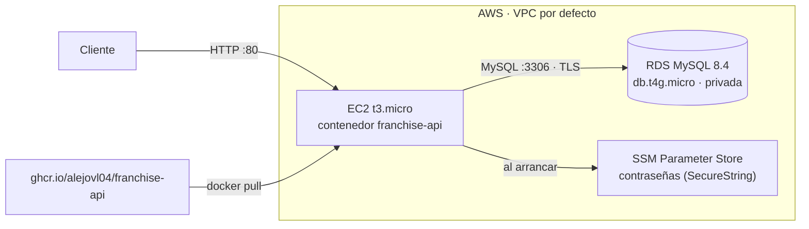

# Despliegue en AWS con Terraform

Infraestructura como código para desplegar la solución completa en AWS: la base de datos MySQL gestionada (RDS) y la API (EC2 con la imagen Docker que publica GitHub Actions).



| Archivo | Contenido |
|---|---|
| `database.tf` | RDS MySQL 8.4 (utf8mb4, cifrada, sin IP pública), contraseñas aleatorias guardadas en Parameter Store |
| `network.tf` | Grupos de seguridad: HTTP a la API desde Internet; MySQL **solo** desde la API |
| `compute.tf` | EC2 Amazon Linux 2023 con rol IAM mínimo (leer sus dos secretos + Session Manager), IMDSv2, disco cifrado |
| `user_data.sh.tftpl` | Primer arranque: Docker, usuario de base de datos de la API (mismos permisos que `database/setup.sql`) y contenedor |
| `outputs.tf` | URL de la API, Swagger, health check y comandos de operación |

Terraform solo crea la base vacía; las tablas y los procedimientos los crea Flyway al arrancar la API, igual que en local y en las pruebas. No hay SSH ni puerto 22: la instancia se opera con AWS Systems Manager.

## Requisitos

- Una cuenta de AWS y un usuario IAM con permisos para EC2, RDS, IAM y SSM (para la prueba basta `AdministratorAccess`) con una *access key*.
- [AWS CLI v2](https://aws.amazon.com/cli/) y [Terraform ≥ 1.6](https://developer.hashicorp.com/terraform/install). En Windows: `winget install Amazon.AWSCLI Hashicorp.Terraform`.

```bash
aws configure          # access key, secret key, región (us-east-1)
aws sts get-caller-identity   # comprueba las credenciales
```

## Desplegar

```bash
cd franchise-api/infra/aws
cp terraform.tfvars.example terraform.tfvars   # opcional: región, imagen, IPs permitidas
terraform init
terraform plan
terraform apply
```

`apply` tarda unos 10 minutos (casi todo es la creación de RDS). Al terminar muestra las salidas:

```text
api_url      = "http://ec2-x-x-x-x.compute-1.amazonaws.com"
swagger_url  = "http://ec2-x-x-x-x.compute-1.amazonaws.com/swagger-ui.html"
health_url   = "http://ec2-x-x-x-x.compute-1.amazonaws.com/actuator/health"
```

La instancia necesita 2–4 minutos más para instalar Docker, crear el usuario de la base y arrancar la API. Cuando `health_url` responde `{"status":"UP",...}` la API está lista.

## Operación

```bash
# Desplegar una versión nueva (descarga la imagen y reinicia el contenedor)
$(terraform output -raw deploy_command)

# Consola en la instancia (requiere el Session Manager plugin)
$(terraform output -raw shell_command)
sudo docker logs -f franchise-api            # logs de la API
sudo cat /var/log/cloud-init-output.log      # log del primer arranque
```

Para fijar una versión concreta en lugar de `:latest`, publicar un tag `vX.Y.Z` en Git (el pipeline genera la imagen `:X.Y.Z`) y poner `api_image` en `terraform.tfvars`; `terraform apply` reemplaza la instancia con esa imagen.

## Eliminar todo

```bash
terraform destroy
```

Borra la instancia, la base de datos (sin snapshot final), los secretos, los grupos de seguridad y el rol IAM.

## Costos

Los tipos por defecto (`t3.micro`, `db.t4g.micro`, 20 GB) entran en la capa gratuita de AWS o en los créditos iniciales de una cuenta nueva. Fuera de ella el entorno cuesta del orden de 25 USD al mes, así que conviene ejecutar `terraform destroy` cuando ya no se necesite.

## Seguridad y límites conscientes

- La base de datos no es accesible desde Internet; solo el grupo de seguridad de la API llega al puerto 3306, y la conexión usa TLS (`sslMode=REQUIRED`).
- Las contraseñas se generan en Terraform y la instancia las lee de Parameter Store; no aparecen en el *user data*. Sí quedan en el estado de Terraform (`terraform.tfstate`, ignorado por Git): para un equipo, el estado iría en un backend remoto cifrado (S3 + DynamoDB).
- La API se sirve por HTTP. Con un dominio se añadiría un Application Load Balancer con certificado de ACM; se omite para mantener el entorno dentro de la capa gratuita.
- Una sola instancia, sin alta disponibilidad: suficiente para una prueba técnica, no para producción real.
